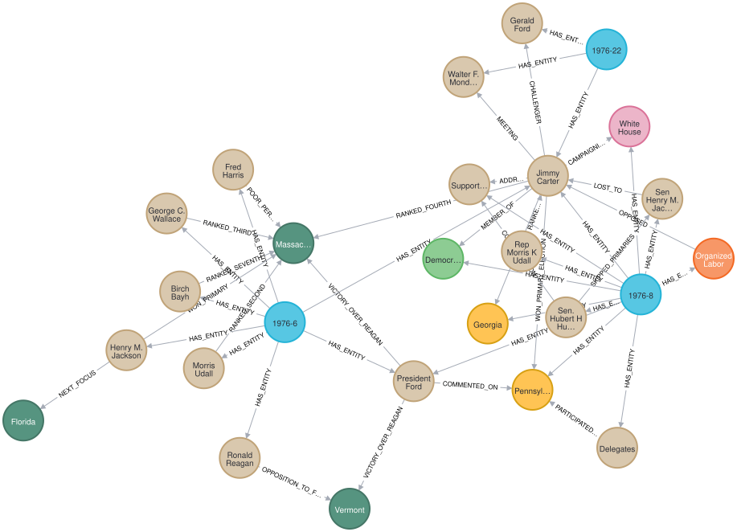
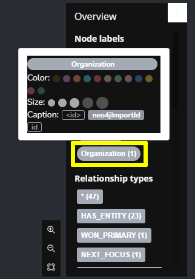
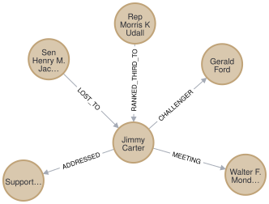

# Neo4j: Jimmy Carter knowledge graph

Standalone GraphAcademy lesson 3 and its exact three-article graph. Requires Docker with Docker Compose and Python 3. No Python packages, API keys, or LLM calls are needed.

## Start and ingest

Start Docker Desktop, then run:

```sh
git clone https://github.com/juananpe/neo4j-course-local.git
cd neo4j-course-local
python3 setup.py
```

Setup generates a random password in `.env`, starts Neo4j 5.26 Community, waits for readiness, imports the graph, and verifies **26 nodes, 47 relationships, and three articles connected to Jimmy Carter**. Setup and `python3 load_graph.py` are safe to rerun.

Open [Neo4j Browser](http://127.0.0.1:7474/browser/). Connect to `bolt://127.0.0.1:7687`, username `neo4j`, with the password shown by:

```sh
cat .env
```

Ports 7474 and 7687 must be free; both bind only to localhost. Data persists in the dedicated Docker volume `newneo4j_election-data`.

## Stop and restart

```sh
docker compose stop
docker compose up -d
```

Run `python3 setup.py` to start and verify again. Article text is also stored in the database:

```cypher
MATCH (a:Article) RETURN a.id, a.date, a.text ORDER BY a.id
```

Relationships are generated course material; assess historical claims against the article text.

## Lesson 3

## Explore a Knowledge Graph

This local database contains a prebuilt knowledge graph.

The knowledge graph represents just 3 news articles covering the 1976 United States presidential election:

- [1976-6](assets/1976-6.pdf): "Jackson wins Massachusetts Democratic primary."

- [1976-8](assets/1976-8.pdf): "Carter wins Pennsylvania Democratic primary"

- [1976-22](assets/1976-22.pdf): "Jimmy Carter wins Presidency"

Learn more about these news articles

The 3 articles were taken from the [NewsWire dataset](https://huggingface.co/datasets/dell-research-harvard/newswire) that contains 2.7 million unique public domain U.S. news wire articles, written between 1878 and 1977.

The dataset was created to provide researchers with a large, high-quality corpus of historical news articles. These texts provide a massive repository of information about historical topics and events - and which newspapers were covering them. The dataset will be useful to a wide variety of researchers including historians, other social scientists, and NLP practitioners.

You can view the [Python code which extracted these articles from the dataset](https://github.com/neo4j-graphacademy/llm-knowledge-graph-construction/blob/main/llm-knowledge-graph/data/newswire/extract_articles.py) in the [`llm-knowledge-graph-construction` repository](https://github.com/neo4j-graphacademy/llm-knowledge-graph-construction).

The knowledge graph maps the relationships between the following entity types referred to in the articles:

- `Person`

- `Location`

- `Organization`

- `Building`

- `Political party`

- `State`

Run this Cypher to reveal how the entities from the articles are related to each other:

```cypher
MATCH p=(a:Article)-[:HAS_ENTITY]->(e)-[r]-()
RETURN p
```



You can see that all 3 articles are connected within the graph through the `Person` entity **Jimmy Carter**.

Node colors and captions

You can set the color of nodes and the text displayed by clicking on the node label, selecting a color and a property to use as the caption.



The relationships within knowledge graphs allow you to explore how entities are connected and related to each other.

For example, how was **Jimmy Carter** connected to other `Person` entities:

```cypher
MATCH (p:Person {id:"Jimmy Carter"})-[r]-(p2:Person)
RETURN p, r, p2
```



You can use the nodes and relationships to understand how different entities are related, for example, `Person` and `State` entities:

```cypher
MATCH (p:Person)-[r]-(s:State)
RETURN p, r, s
```

The following query will show you how the entities of a specific article are connected in the knowledge graph:

```cypher
MATCH (a:Article {id:"1976-8"})-[:HAS_ENTITY]->(e)

MATCH (e)-[r]-(e2)
WHERE (a)-[:HAS_ENTITY]->(e2)

RETURN e, r, e2
```

Restricting the entities to only those from a specific article will give you a structured data view of that article.

Take some time to explore the knowledge graph and see how the entities are connected. Clicking on a node will display its properties. You can double-click on a node or click to focus on a node, then click the graph icon to expand its relationships.

### Check your understanding

### The Challenger to Jimmy Carter

Using the relationships in the knowledge graph determine who was the challenger to Jimmy Carter?

- [ ] Sen Henry M. Jackson

- [ ] Rep Morris K Udall

- [x] Gerald Ford

- [ ] Walter F. Mondale

Show hint

Hint

The answer is the `id` property on the `(:Person)` node at the end of the `CHALLENGER` relationship from Jimmy Carter.

Show solution

Solution

The answer is **Gerald Ford**. You can find the answer by executing the following Cypher statement:

```cypher
MATCH (p:Person)-[r]-(:Person {id:"Jimmy Carter"})
RETURN p.id AS Person, type(r) AS Relationship
```

### Summary

In this lesson, you explored a pre-built knowledge graph in Neo4j.

## Validation

Tested on 2026-10-05: startup from an empty Docker volume, repeat import without duplicates, stop/start persistence, all six README Cypher queries, the Gerald Ford challenger answer, Browser HTTP access, and a Bolt query using `cypher-shell`. Verified 26 nodes, 47 relationships, and exactly three articles.

## Attribution

Unofficial teaching copy of Neo4j GraphAcademy course content; upstream authors retain their rights.

### Upstream sources

Snapshot taken 2026-10-02.

- [curriculum](https://github.com/neo4j-graphacademy/courses), commit `ead656478b8a66ae25cb1eafdd1ee74018541c3c`
- [exercises](https://github.com/neo4j-graphacademy/llm-knowledge-graph-construction), commit `4f3d92d97e9be5c700dc09eb9ee0f3c5ef324203`

The curriculum snapshot contains only `asciidoc/courses/llm-knowledge-graph-construction`. Local HTML was generated from these sources.
